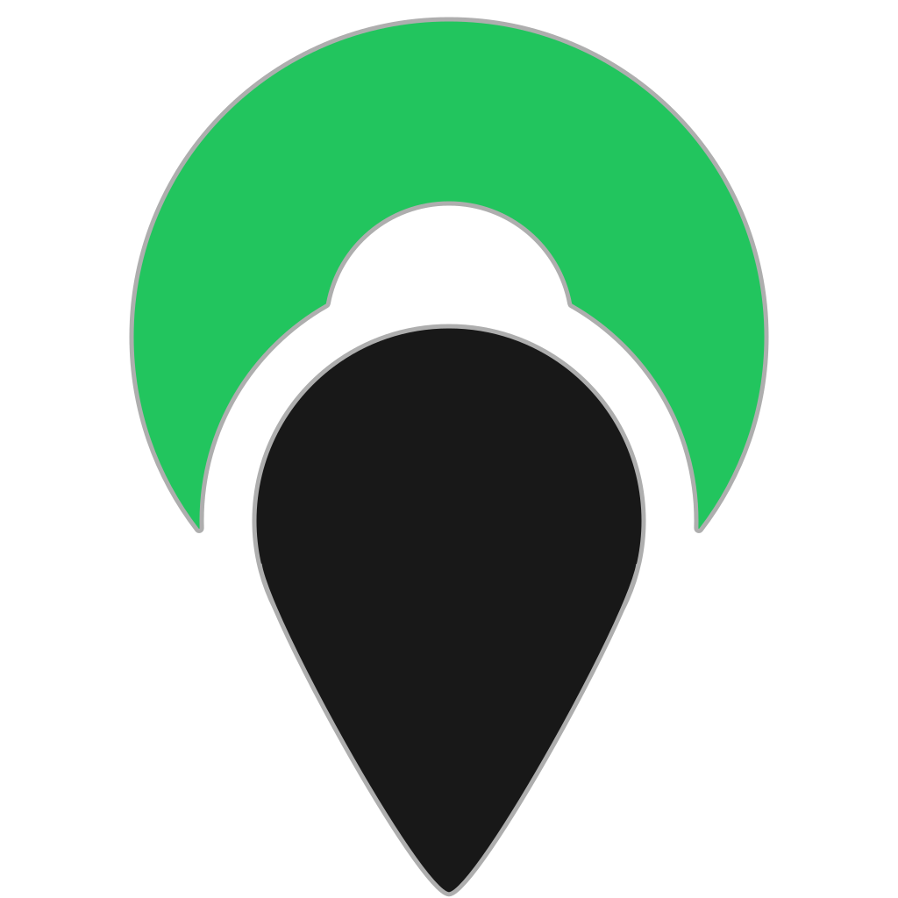

<p align="center">
  
</p>

<h1 align="center">OhneGuessr</h1>

<p align="center">A completely free, debloated and local GeoGuessr alternative.</p>

<p align="center">
  <a href="LICENSE.md"></a>
</p>

## Features

- Runs locally, no API keys or sign-in.
- Multiple free map styles (OSM, Carto, Esri, satellite, terrain).
- Distance-based scoring, per-round result screen, end-of-game summary map.
- Adjustable rounds per game and per-location time limit.

## Setup

You need Python 3.7+:

**Windows:**

```powershell
winget install python3
```

**macOS:**

```bash
brew install python
```

Clone the repo, or download the [ZIP](https://github.com/0hneB/OhneGuessr/archive/refs/heads/main.zip) and unzip it:

```bash
git clone https://github.com/0hneB/OhneGuessr.git
```

### Windows

Double-click **`run\serve.bat`**. It starts the local server and opens your browser at `http://localhost:8000`; run **`run\stop.bat`** to stop it.

### macOS / Linux / manual

```bash
python run/serve.py
```

That serves the folder at `http://localhost:8000` and opens your browser. Stop it with Ctrl+C.

> [!IMPORTANT]
> `run/serve.py` does two jobs: it serves the static files, and it accepts uploads so maps you add in Settings get written into `data/`. A plain `python -m http.server` will serve the game fine but **map uploads, renames, and deletes won't work** without `run/serve.py`.

## Usage

1. Start the server (above) and let the browser open.
2. Upload and pick a map under **Maps**
3. Look around the panorama, click the small map in the bottom corner to drop your guess, and press **Guess**.
4. See how far off you were, press **Next**, and repeat until the game ends.

### Controls

| Key | Action |
| --- | --- |
| <kbd>Space</kbd> | Submit your guess, go to the next round, or play again after game over |
| <kbd>E</kbd> / <kbd>Q</kbd> | Zoom the panorama in / out |
| <kbd>N</kbd> | Face north. Press again while already facing north to look straight down |
| <kbd>R</kbd> | Reset the view |
| <kbd>F</kbd> | Toggle the fullscreen guess map |
| <kbd>H</kbd> | Hide all UI, including the guess map and Street View navigation arrows |

You can also drag to look around and scroll to zoom the panorama, and click/drag/scroll the guess map as usual.

> [!TIP]
> All shortcuts are rebindable in **Settings → Controls** — click a key, then press the one you want (Esc cancels, Backspace clears). The defaults live in [`assets/js/config.js`](assets/js/config.js) under `KEYBINDINGS` (using [`KeyboardEvent.code`](https://developer.mozilla.org/docs/Web/API/KeyboardEvent/code) values like `KeyE`, `Space`, or `ArrowUp`); in-app changes are saved to your browser and override them.

## Settings

Settings open from the gear icon and are saved in your browser's `localStorage`, so they stick between sessions.

| Setting | Options | Notes |
| --- | --- | --- |
| Map style | OpenStreetMap, OSM Humanitarian, CartoDB Light/Voyager/Dark, Esri Light/Dark Gray, Satellite, Terrain | The base layer for the guess map |
| Accent color | Any color | Changes the UI highlights and is saved locally |
| Application fullscreen | On / off | Puts the whole app into browser fullscreen |
| Rounds per game | Unlimited, 5, 10, Custom | Custom takes any whole number |
| Time limit | Unlimited, 2 min, 5 min, Custom | Per **location**. Custom is in minutes |
| Scoring | World, Country | World uses a fixed world-map scale; Country scales to the loaded map's location bounds (stricter) |
| Maps | — | Add, select, rename, export, or delete maps (see below) |

## Maps

A map is just a JSON file of locations. They live in [`data/`](data/), and [`data/maps.json`](data/maps.json) is the index that tells the game which maps exist.

### Adding a map

Bring your own maps ([Map Making App](https://map-making.app/) / [MapGenerator](https://map-g3nerator.vercel.app/)).

Open **Settings → Maps → Add a map** and drop a `.json` file onto the box (or click to browse). The file is saved into `data/` + an entry is added to `data/maps.json`.

Each row in the map list has a rename (✎) and delete (×) button:

- **Rename** changes the display name *and* renames the file on disk.
- **Delete** removes the map from the list *and* deletes the file from `data/`.

Use **Export selected map** beneath the list to download the active map's JSON file.

> [!CAUTION]
> Deleting a map removes its file from `data/` permanently. There's no undo — keep a copy if you might want it back.

### Map file format

A JSON array of location objects. Each needs `lat` and `lng`; `panoid`, `heading`, and `pitch` are optional. Without a pano ID, the game asks Street View for imagery nearest the coordinates.

```json
[
  { "lat": 48.8584, "lng": 2.2945, "panoid": "…", "heading": 0, "pitch": 0 }
]
```

> [!NOTE]
> You can just use your Map Making App JSON exports

## Troubleshooting

### "Could not save the map. Is the local server (run/serve.bat) running?"

The upload went to a server that can't write files. Make sure you started the game with `run/serve.bat` (or `python run/serve.py`) and that the browser is on `http://localhost:8000`, not a `file://` path or some other server.

### Panoramas don't load, or stay blurry / black

- Check your internet connection.
- That particular location may be bugged or deleted
- If it's just blurry, the higher-quality pass is still loading. Give it a moment to sharpen.

### Browser opened but the page is blank or errors in the console

You probably opened `index.html` directly. Run `run/serve.bat` / `python run/serve.py` and use the `http://localhost:8000` URL instead.

### Port 8000 is already in use

That usually means a server is already running. `run/serve.py` notices this and just opens the browser instead of starting a second one. If something *else* is on 8000, stop it (or stop the old game with `run/stop.bat`).

### `pythonw` not found

`run/serve.bat` falls back to a minimized regular `python` window. Everything still works — there's just a small window you can leave minimized.

### Where's the server log?

When it runs windowless there's no console, so errors go to `ohneguessr-serve.log` in your system temp folder (`%TEMP%` on Windows).

## License

Copyright © 2026 OhneB

Released under the [PolyForm Noncommercial License 1.0.0](LICENSE.md).

This license covers only this project's own code and assets.
